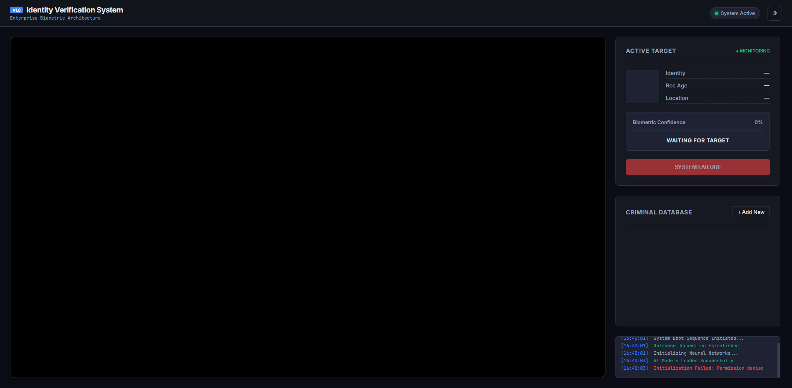

# 🛡️ Biometric Access Control System (V9.2)

### 🚀 **[View Live Demo: High-Security Authentication](https://identity-verification-system.netlify.app/)**

An enterprise-ready, browser-based facial authentication and identity management system.

## 🎯 The Purpose: Privacy-First Security
In an era of increasing security needs, this project demonstrates a **privacy-first biometric solution**. By performing all facial recognition tasks directly on the client-side using `face-api.js`, sensitive biometric data never has to leave the user's device. This is a blueprint for secure, distributed identity verification.

## 👥 Who This Is For
- **SaaS Companies**: Implementing secure, friction-less biometric login systems.
- **HR Tech Platforms**: Managing employee attendance or sensitive area access.
- **Security-Focused Startups**: Building client-side only biometric verification for high-privacy applications.

## ✨ Core Features
- **Client-Side Authentication**: Real-time biometric matching without server-side image processing.
- **Authorized Personnel Management**: Secure Admin Panel for managing authorized user records.
- **Biometric Confidence Meter**: High-precision scoring for identity verification.
- **Synthesized System Feedback**: Voice-guided status updates for a premium enterprise experience.

## 🛠️ Tech Stack
- **Engine**: [face-api.js](https://justadudewhohacks.github.io/face-api.js/) (Powered by TensorFlow.js)
- **UI/UX**: Custom CSS Variable System (Polished Enterprise Dark Theme)
- **Logic**: Vanilla ES6 JavaScript

## 🚀 Quick Setup
```bash
git clone https://github.com/amanamarjit243222/Face-recognition.git
cd Face-recognition
python -m http.server 8000
```
*Admin Access Code:* **100**

## 📸 Interface Preview



## 📄 License
Open-source / Personal Portfolio Project.
